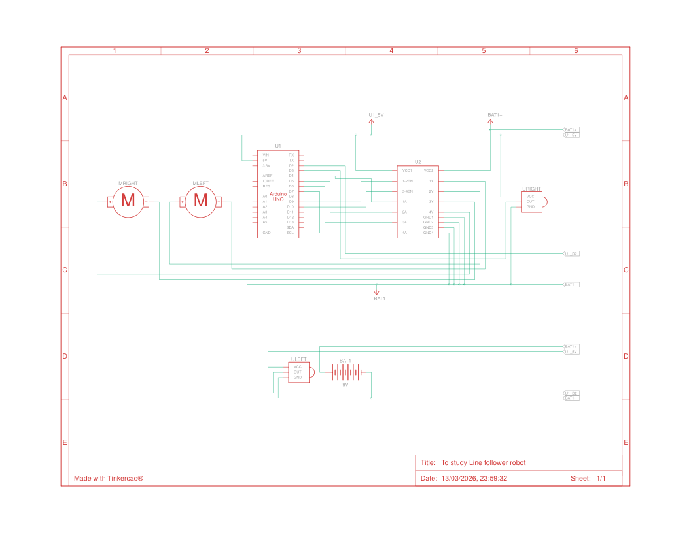

# line-follower-robot
A basic line follower robot simulation created in Tinkercad using Arduino and IR sensors for practice.

## Components Used

| Component | Quantity |
|-----------|----------|
| Arduino Uno R3 | 1 |
| H-bridge Motor Driver | 1 |
| DC Motor | 2 |
| IR Sensor | 2 |
| 9V Battery | 1 |

## Circuit Diagram

## Software Used
Tinkercad Circuit Simulation
